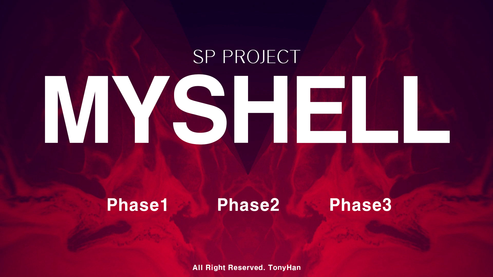

 
developer : Han Chan Hee 
student id : 20182204 
date : 2021-05-24 ~ 2021-05-31 
 

> Shell 명령어는 소문자로 입력 
> phase 1 : cd, ls, mkdir, rmdir, touch, cat, echo, exit, ';' 사용가능 
> phase 2 : pipeline, grep 사용가능 
> phase 3 : jobs, bg, fg, kill 사용가능 
 
 

**컴파일** 
    (make)를 입력하여 컴파일 
 

**실행** 
    (./myShell.out)을 입력 
    이후 사용하고자 하는 명령어 입력 
    (질의 응답 게시판 및 명세서를 보고 파일명은 모두 소문자, 실행 파일은 S만 대문자로 설정) 
 

**삭제** 
    (make clean)을 입력 
    오브젝트 파일을 포함한 실행파일까지 삭제 
 

**명령어** 
    입력 프롬프트*CSE4100-SP-P4>*에 다음과 같은 명령어를 입력 가능 
    - cd [위치]: 현재 디렉토리 변경, 만약 위치가 입력 없을 경우 homeDir로 이동 
    - ls [-옵션]: 현재 디렉토리 파일 확인 
    - mkdir [이름]: 폴더 생성 
    - rmdir [이름]: 현재 디렉토리에 새로운 폴더 생성 
    - touch [파일명]: 파일 생성 
    - cat [파일명]: 파일명 내용 확인 
    - echo [내용/파일명]: 내용/파일명을 출력 
    - exit : 프로그램 종료 
    - '<''>' : 입력 파일, 출력 파일 설정 가능 
    - ';' : 세미콜론으로 다수의 명령어 입력 가능 
    - '|' : 파이프라인 기능 가능 
    - jobs : 현재 돌아가고 있는 job 전체를 출력 
    - bg [jobId]: jobId에 해당하는 프로세스를 background로 이동 
    - bg [[%]jobId] : jobId에 해당하는 프로세스를 background로 이동 
    - fg [jobId]: jobId에 해당하는 프로세스를 foreground로 이동 
    - fg [[%]jobId] : jobId에 해당하는 프로세스를 foreground로 이동 
    - kill [jobId]: jobId에 해당하는 프로세스를 종료 
    - kill [[%]jobId]: jobId에 해당하는 프로세스를 종료 